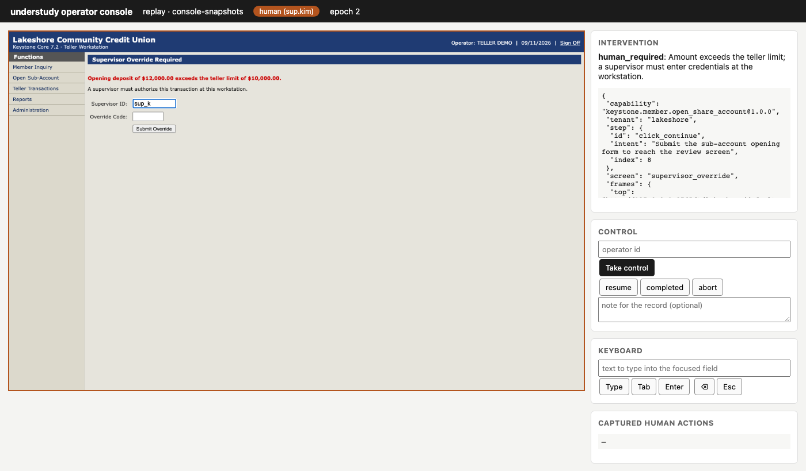

# understudy

**An LLM learns a back-office task once. After that, a reviewed artifact performs it deterministically, with no model in the loop.**

Banks and credit unions run a long tail of legacy back-office applications with no API: core banking screens, servicing tools, admin consoles. understudy gives an AI agent hands for those applications:

1. **Discover.** An LLM drives the real UI toward a natural-language goal, under a safety policy, and can hand the live session to a human when it gets stuck or reaches an irreversible step.
2. **Compile.** The run becomes a typed, versioned **capability**: a contract (typed inputs, outputs, business outcomes) plus a flow (steps, robust targets, checkpoints, risk). It is reviewable YAML in git.
3. **Replay.** An agent invokes the capability by name with typed arguments. It runs deterministically, handles runtime conditions (interstitials, timeouts, session expiry, "no such member"), escalates to a human when needed, and returns a structured result.

Design decisions and trade-offs are in **[REPORT.md](REPORT.md)**. Recorded runs are in **[evidence/](evidence/)**.


*The operator console mid-replay. A supervisor holds control of the live session the automation was using, entering an override. Their actions are captured, secrets masked, and control is handed back.*

## What's in the repo

| | |
|---|---|
| `src/keystone_mock/` | **The target.** *Keystone Core 7.2*, a deliberately legacy teller workstation (framesets, table layouts, `<td onclick>` menus, regenerated ids, per-session URL tokens, native dialogs). It has two tenants (`lakeshore`, `pinecrest`) and injectable runtime faults. All data is synthetic. |
| `src/understudy/surface/` | Surface adapter (Playwright) and `perceive.js`: one in-page module for perception, target resolution, and locator description. |
| `src/understudy/agent/` | The discovery loop (observe → decide → act), model clients (Anthropic SDK, OpenAI-compatible, scripted), prompt and tools. |
| `src/understudy/compile/` | Trace → capability: validated locators, parameterisation, tenant-neutral vocabulary, detour pruning, review notes. |
| `src/understudy/replay/` | The deterministic replay engine and its error taxonomy. |
| `src/understudy/hitl/` | Control lease, operator console, page-level human-action capture, and a scripted operator. |
| `src/understudy/safety/` | Policy guard (allowlist, risk classification) and redaction. |
| `src/understudy/schema/` | Every document type as strict Pydantic models. JSON Schemas are exported to [`docs/schema/`](docs/schema/). |
| `profiles/` `tenants/` `policies/` `goals/` | The app profile (Keystone Core 7), the two tenant bindings, the safety policy, and the two discovery goals. |
| `capabilities/` | The capability store. Both artifacts here were produced by real discovery runs. |
| `evidence/` | Discovery, verification, and replay runs: logs, masked screenshots, results. Start with [evidence/README.md](evidence/README.md). |

## Setup

Requires Python 3.11+ and [uv](https://docs.astral.sh/uv/).

```bash
uv sync --all-extras
uv run playwright install chromium
cp .env.example .env
```

`.env` holds the mock's synthetic operator credentials (pre-filled) and your model key, if you run discovery. It is gitignored and never read into artifacts or logs.

- **Anthropic:** set `ANTHROPIC_API_KEY`. Default model `claude-opus-5`, override with `UNDERSTUDY_MODEL`.
- **OpenAI-compatible** (the recorded runs used Zhipu GLM this way): set `UNDERSTUDY_LLM=openai`, `OPENAI_API_KEY`, `OPENAI_BASE_URL` and `UNDERSTUDY_MODEL`. For a text-only model, add `UNDERSTUDY_VISION=0`: the agent then works from the accessibility-derived UI map alone.

Start the target app in its own terminal and leave it running:

```bash
uv run understudy mock
```

It serves `http://127.0.0.1:8765/t/lakeshore/signon.asp` and `/t/pinecrest/`. The operator console starts automatically on `:8766` whenever a run may need a human.

## Demo path

### 1. Discover: a real model drives the UI, and the run becomes a capability

```bash
uv run understudy discover lookup_balance -t lakeshore -i member_id=100234
```

This runs the agent loop against the live mock, compiles the trace into a capability, replays it once without the model to verify it, and saves `capabilities/keystone.member.lookup_balance/<version>.yaml` with status `verified`.

The write flow (form → review → irreversible confirm) needs a human for the last step. The console link is printed when the agent asks: open it, press **Take control**, click **Confirm & Open Account** in the live view, then press **completed**.

```bash
uv run understudy discover open_share_account -t lakeshore -i member_id=104410 -i "product=Money Market Share" -i "nickname=Rainy day fund" -i opening_deposit=1500 -i fund_from=00
```

To let a scripted operator do that part instead, add `--operator-script examples/operators/approve_in_discovery.yaml`.

**No model key?** Add `--llm scripted:examples/scripted/lookup_balance.yaml`, or `--llm scripted:examples/scripted/open_share_account.yaml` together with the operator script above. The scripted stand-in reads the same UI map a model reads and picks elements by what they say, so the whole pipeline runs offline.

### 2. Review and approve

```bash
uv run understudy show keystone.member.lookup_balance
```

```bash
uv run understudy approve keystone.member.lookup_balance --by your-name
```

`show` prints the reviewer card: contract, steps, locators, checkpoints, review notes. The approval binds to the content hash, so editing a step voids it.

### 3. Replay: deterministic, no model

```bash
uv run understudy replay keystone.member.lookup_balance -t lakeshore -i member_id=100234 --require-approved --reveal
```

`--require-approved` is production mode. `--reveal` prints the outputs; they are never written to disk.

Business outcomes, invalid input, and injected runtime faults:

```bash
uv run understudy replay keystone.member.lookup_balance -t lakeshore -i member_id=999999
```

```bash
uv run understudy replay keystone.member.lookup_balance -t lakeshore -i member_id=12ab
```

```bash
uv run understudy fault session_expired -t lakeshore --page mbrinq.asp --method POST
```

```bash
uv run understudy replay keystone.member.lookup_balance -t lakeshore -i member_id=100234
```

Other faults: `notice`, `host_error`, `slow --delay-ms 4000`, `server_error`, `deny`. They fire on the next matching request; reset with `uv run understudy fault reset`.

The same capability on a second tenant, first with its vocabulary, then without it to show graceful degradation:

```bash
uv run understudy replay keystone.member.lookup_balance -t pinecrest -i member_id=100234
```

```bash
uv run understudy replay keystone.member.lookup_balance -t pinecrest -i member_id=100234 --no-overrides
```

### 4. Human in the loop on replay

The irreversible confirmation pauses for an approval. Opening deposits over $10,000 also trigger a supervisor-override screen, which needs a person to take over the live session. Leave out `--operator-script` to act yourself in the console:

```bash
uv run understudy replay keystone.member.open_share_account -t lakeshore -i member_id=104410 -i "product=Money Market Share" -i "nickname=Rainy day fund" -i opening_deposit=12000 -i fund_from=00 --supervised --operator-script examples/operators/supervisor_override.yaml
```

Without `--supervised` the same command stops with `POLICY_BLOCKED` at the irreversible step, and nothing is committed.

### 5. As a tool for an AI agent

```bash
uv run understudy catalog
```

```bash
uv run understudy ask "How much can member 100234 at Lakeshore withdraw from their savings right now?"
```

`catalog` prints each capability as a tool definition. `ask` gives a model that catalog: it picks the capability, supplies typed arguments, and gets the structured result back. The replay itself runs without a model.

### All recorded scenarios at once

```bash
./scripts/demo_replays.sh
```

This regenerates the 13 replay runs in `evidence/runs/`.

## Running without live services

- **Model:** the scripted stand-in (`--llm scripted:…`) replaces it.
- **Human:** a simulated operator (`--operator-script …`) replaces the human. It drives the real operator console over HTTP, and its actions go through the same capture as a person's.
- **Tests:** they start their own mock on a free port and need nothing else.

```bash
uv run pytest
```

72 tests, about 2 minutes. They cover schema rules, redaction, policy, tenant composition, the compiler, and the control-transfer state machine. Against a real browser they cover perception, replay across every fault, approval and takeover handoffs, and offline discovery → compile → verify. A final test scans all written evidence for the mock's synthetic PII.

## Configuration

| variable | purpose |
|---|---|
| `KEYSTONE_<TENANT>_USERNAME` / `_PASSWORD` | Operator credentials, resolved from each tenant's `credentials: env:…` reference at sign-on. |
| `KEYSTONE_BASE_URL` | Where the mock runs (default `http://127.0.0.1:8765`). Used by the tenants and the policy allowlist. |
| `KEYSTONE_SUPERVISOR_CODE` | Only for the simulated supervisor in `examples/operators/`. |
| `UNDERSTUDY_LLM` | `anthropic` (default), `openai`, or `scripted:<path>`. |
| `UNDERSTUDY_MODEL`, `UNDERSTUDY_VISION`, `UNDERSTUDY_EFFORT` | Model selection; `UNDERSTUDY_VISION=0` for text-only models. |
| `UNDERSTUDY_EVIDENCE_DIR` | Where runs are recorded (default `evidence/runs`). |
| `UNDERSTUDY_FINGERPRINT_KEY` | HMAC key for output fingerprints (default: a local key in `.understudy/`). |
