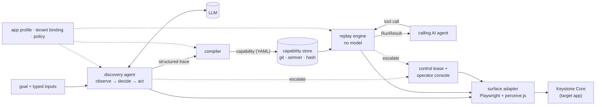

# understudy: design report

understudy lets an LLM work out a back-office task once, compiles what it did into a typed, versioned **capability**, and replays that capability deterministically with no model in the loop.

The target is *Keystone Core*, a deliberately hostile legacy teller workstation I wrote as a stand-in: framesets, table layouts, `<td onclick>` menus, regenerated ids, per-session URL tokens, native dialogs, interstitials, two tenants and injectable faults. Both discovery runs in [`evidence/`](evidence/) used a real model (Zhipu GLM via its OpenAI-compatible API): one multimodal, one text-only. The two resulting capabilities replay across 13 scripted scenarios, and 72 offline tests cover the rest.

## 1. Architecture



- **Perceive the way an operator does.** One in-page module, [`perceive.js`](src/understudy/surface/perceive.js), handles perception, resolution and description. It uses an accessibility-style vocabulary: role, accessible name, *visual label* (inferred from the cell beside or above a field, because legacy forms have no `<label>`), visible text, and table cell by header plus row key. With a single implementation, "what the model saw", "what was recorded" and "what replay looks for" cannot drift apart. Screenshots are optional context: the pipeline produced capabilities both with a vision model (GLM-4.6V, screenshot plus UI map) and a text-only model (GLM-5.3, UI map only).
- **The platform handles what it knows; the model handles the unknown.** Sign-on is deterministic, so the model never sees credentials. Known interruptions (notices, host timeouts, session expiry) are handled by the runtime during discovery too, and conditions that need a human escalate automatically. The model only has to find the path, and the trace stays clean.
- **Stateless model calls.** Each decision is one request: a fixed system prompt and tool list (cacheable), plus goal, compact history and current screen. Context stays bounded and every decision is auditable on its own. The client is provider-agnostic: Anthropic SDK (default `claude-opus-5`), any OpenAI-compatible endpoint, or a scripted stand-in for offline runs.
- **Typed documents in git.** Capability, app profile, tenant binding, policy, goal, trace and run result are strict Pydantic models with exported JSON Schemas ([`docs/schema/`](docs/schema/)). Review is a diff; approval binds to a content hash.
- **One process, one live session per run.** A browser session is stateful, and a human handoff needs automation and the operator surface on the same session. Scaling means more workers owning sessions. No queue or cluster was needed here.
- **A self-built target.** It gives deterministic access to every runtime condition in the brief, with no terms-of-service or PII concerns. The risk is that I control it; I mitigated this by making it hostile, and the system only touches it through the browser.

## 2. Artifact schema

A capability ([`capabilities/`](capabilities/), [`schema/capability.py`](src/understudy/schema/capability.py)) reads top-down in four parts:
- **identity:** id, semver, lifecycle, target product and versions
- **contract:** what a caller supplies, gets back, and must handle
- **flow:** entry screen, steps, success condition
- **evidence:** provenance and review notes

```yaml
inputs:
  member_id: {type: string, pattern: "^[0-9]{4,10}$", sensitivity: internal}
outputs:
  savings_balance:
    type: money
    sensitivity: financial
    source:                       # outputs may only use semantic locators (schema-enforced)
      within: [{frame: main}]
      locators:
      - {by: table_cell, headers: [Description, Current Balance], row: {Description: Share Savings},
         column: Current Balance, why: "a grid value by column header and row key, never by position"}
outcomes:
- {code: MEMBER_NOT_FOUND, condition: record_not_found, description: No member has this member number.}
steps:
- id: enter_member_number
  action: fill
  screen: member_search           # precondition
  target:
    within: [{frame: main}]
    locators:                     # ordered by robustness; each validated live at discovery
    - {by: label, role: textbox, label: Member Number, why: "the label printed next to the field; ..."}
    - {by: attr, tag: input, attrs: {name: txtMbrNo}, why: "vendor-set attribute; tenants rarely change it"}
  value: "{{inputs.member_id}}"
  risk: reversible                # irreversible ⇒ approval: required (schema-enforced)
```

Why this shape:
- **The contract is separate from the flow.** A calling agent needs only inputs, outputs and outcomes, and those map one-to-one onto a tool definition (`understudy catalog`). The flow can be re-recorded or overridden per tenant without touching the contract. Every input and output carries a **sensitivity** label, which drives redaction downstream.
- **Business outcomes are declared.** Each maps an app-profile runtime condition to a caller-facing code, so "no such member" is an answer, not an exception.
- **Targets are a scope chain plus several independent locators, each with a `why`.** The compiler keeps only candidates that matched *exactly one element, and the same element*, at the moment of the action. Positional XPath is never executed. Outputs cannot fall back to structural locators, because a wrong read returns wrong data silently.
- **Every step has a precondition (`screen`) and a checkpoint (`expect`)**, written in a small declarative condition language a reviewer can read.
- **Versioned and reviewable.** The format carries a schema version (`understudy/capability@1`); the capability uses semver (a contract change bumps the major), and a content hash covers behaviour only. The lifecycle runs from draft to **verified** (replayed once without the model, stopping before any commit) to **approved** (bound to that exact hash, so editing a step voids it). Production mode (`--require-approved`) runs nothing else. Provenance records the model, run id, trace digest and verifications; the compiler's lint becomes review notes.

The compiler is what turns a transcript into a contract. It:
- templates literal input values, matching whole tokens only
- maps a tenant's labels back to the vendor's vocabulary
- prunes detours (navigation the next action overwrote)
- turns incidental steps into review notes, since the profile owns those conditions
- refuses to write member data anywhere in the artifact

## 3. Determinism & error handling

**Replay** ([`replay/engine.py`](src/understudy/replay/engine.py)) runs each step through the same stages:
1. Park if a human holds control.
2. Settle: wait for network quiet and every frame loaded, with a grace period for navigations a script starts a tick late.
3. Scan runtime conditions by priority.
4. Wait for the precondition screen.
5. Resolve locators in order, requiring exactly one visible match.
6. Run the policy check against the *live* control.
7. Act.
8. Wait for the checkpoint.

The checkpoint wait *races* condition detection, so "No records match" resolves in milliseconds as a business outcome instead of timing out as a failure. Everything is bounded, and nothing calls a model.

**The error taxonomy** lives in the app profile, written once per vendor product:

| class | Keystone examples | engine response | evidence run |
|---|---|---|---|
| business | not found, restricted member, access denied, validation message, pending-address `confirm()` | return `business_outcome` with the capability's code and the app's own message; leave the app clean | `lookup-not-found`, `open-deposit-rejected` |
| recoverable | maintenance notice, host timeout, session expiry, tenant bulletin | bounded retries with backoff (Acknowledge, Retry, re-sign-on then restart from entry, the last **only if no irreversible step ran**) | `lookup-session-expired`, `lookup-interstitial-and-retry` |
| human_required | supervisor override above the teller limit | escalate on the live session, wait, re-sync | `open-supervisor-override` |
| fatal | server error page, stale request context | hard failure | `lookup-app-error` |

The engine raises its own hard failures for anything the profile cannot explain: `UNEXPECTED_SCREEN`, `TARGET_NOT_FOUND`, `TARGET_AMBIGUOUS`, `CHECKPOINT_FAILED`, `UNEXPECTED_DIALOG`, `OUTPUT_INVALID`, `POLICY_BLOCKED`, `NOT_APPROVED`, and `INVALID_INPUT` (caught before the UI is touched).

A `RunResult` has exactly three statuses: `succeeded` (typed outputs), `business_outcome` (code plus the app's message), or `failed`. A failure reports:
- the step, and what was expected versus observed
- whether it is retryable
- a masked screenshot and a redacted UI map

Recoveries never change the status. They are listed so a caller can see the run was bumpy.

**UI drift** (secondary):
- A primary-locator miss that a fallback resolves continues with a `locator_drift` warning, which serves as a maintenance signal.
- Locators that disagree trigger a warning, and a hard failure on irreversible steps.
- Reads never fall back.

The `pinecrest-no-vocabulary` run shows all three: navigation survives on vendor-level attributes with two drift warnings, then the balance read fails loudly.

## 4. Heterogeneity & multi-tenant

**The surface seam.** The flow speaks only in scopes, roles, names, labels, text, table cells and conditions. Surface-specific code sits behind the [`Surface`](src/understudy/surface/base.py) protocol: observe, resolve, act, settle, screenshot.
- **Legacy web** is implemented. Keystone *is* the legacy case.
- **Desktop:** a UI Automation or AX adapter maps role and name one-to-one, derives labels from spatial proximity, uses the existing `attr` locator for `AutomationId`, and uses the `window` scope already in the schema.
- **Pixels only (Citrix/VDI):** OCR text plus `point` locators within a scope. These are in the schema and flagged by the compiler.

The capability format, compiler, replay engine and handoff model do not change.

**Multi-tenant reuse** comes from layering, not re-recording:
1. An **app profile** per vendor product and version (screens, runtime conditions, sign-on, commit rules).
2. **Capabilities** written in the vendor's default vocabulary.
3. A **tenant binding**: base URL, a credential *reference*, a vocabulary map (relabels, fixed once per tenant for every capability), tenant-only conditions (Pinecrest's mandatory bulletin), and, as a last resort, targeted overrides.

The effective view is composed at load time, and every override applied is listed in the run result. The capability recorded on Lakeshore runs unchanged on Pinecrest (`pinecrest-with-vocabulary`).

**Drift is managed through:**
- drift warnings aggregated per tenant, capability and step, as a health signal
- a check of the tenant's `product_version` against the capability's `app.versions`
- onboarding by conformance replays on the new tenant's sandbox, whose drift becomes vocabulary entries (model-proposed, human-approved)

## 5. Escalation & handoff

**Detecting "stuck":**
- **Discovery:** the model calls `request_human`; the loop sees a repeated action with no screen change, four failed actions in a row, or turns with no tool call; or a profile `human_required` condition or an irreversible step comes up.
- **Replay:** `human_required` conditions and the approval gate escalate. With `--supervised`, so do stuck failures; unattended runs fail fast instead.

**Routing.** An [`InterventionRequest`](src/understudy/schema/intervention.py) carries the kind and reason, the capability, step and screen, frame URLs, recent actions, a masked screenshot, the allowed resolutions, and a console link.

**Control** ([`hitl/control.py`](src/understudy/hitl/control.py)) is a single-holder lease on the live session: `automation → paused → human → automation`.
- Every transfer bumps an epoch and is logged.
- Automation calls `checkpoint()` before every action, so an operator can also take over unasked.
- The [operator console](src/understudy/hitl/console.py) serves the *same* browser context, with a live view, click/type/key/dialog relay, and claim/release.
- [`capture.js`](src/understudy/hitl/capture.js) records the human's actions from inside the page, whether they came through the console or a headed window, with secrets masked.

**On hand-back** the resolution decides what happens next:
- `resume`: replay re-identifies the current screen and skips steps the human already did.
- `approve`: the automation performs the gated step itself.
- `reject`: the run returns the business outcome `OPERATOR_REJECTED`.

**Human steps at discovery become artifact steps.** In `discovery-open_share_account` the model stopped on the review screen, and the approval was given *through the console UI* by the AI coding assistant I built this with, acting as the operator. The captured click came through the operator channel, so it became an `origin: human`, irreversible, approval-gated step, which pauses for approval at every replay (`open-approved`). In `open-supervisor-override` the scripted operator, playing a supervisor, took over mid-replay; its input was captured as `[secret]`, and automation resumed on the same session.

## 6. Safety

**Guardrails.** Enforcement happens at three layers:
1. **Action:** the action type must be allowed for the mode, and the live control is classified by the app profile's commit rules, then global commit-verb rules.
2. **Step:** irreversible actions are *blocked* in discovery, so the model can never commit, and need a *per-invocation human approval* in replay.
3. **Network:** the browser aborts any request outside the origin/path allowlist, which catches `javascript:` navigations and redirects no element check can see.

An artifact also cannot downgrade a live commit control. A step declared reversible that would click an irreversible control stops with `POLICY_BLOCKED`.

**Data handling:**
- **Model input:** the model sees pii and secrets masked (screenshots blacked out before capture, placeholders in the UI map), sensitive inputs only as `{{inputs.x}}`, and never credentials.
- **Persistence:** everything is redacted *at write time*, using registered values (with fuzzy matching of re-typed names), values the page itself flagged, and patterns. Outputs are stored as a placeholder plus an HMAC fingerprint, so runs can be compared without storing values.
- **Artifacts:** the compiler refuses to write member data into them.
- **Leak scan:** a CI test checks every evidence and artifact file for the mock's synthetic PII. It caught four real leaks during development.

**Limits:**
- Sensitivity detection is heuristic, so an unlabelled free-text field can slip through.
- Discovery sends screens to a model provider, so it belongs on sandbox tenants with synthetic data, under a proper data agreement.
- Commit classification reads labels, so an unclassified commit button defaults to reversible. Production profiles should default-deny unknown submit controls.
- The allowlist is per origin and path, not per parameter.
- The console uses a localhost bearer token.
- Evidence retention and access control are out of scope.

## 7. Cuts

**Cut, with the seam kept:**
- desktop and pixels-only adapters
- a production co-browsing console (video, SSO, queue and paging)
- vault integration (credentials are env references)
- multi-worker scheduling and drift dashboards
- LLM-drafted app profiles (hand-written profile knowledge is the right default)
- detour pruning beyond the "overwritten navigation" pattern

**Stretch goals chosen:**
- **An agent-facing capability interface.** `understudy catalog` and `understudy ask` show a model answering member questions by calling the capability, including explaining `MEMBER_NOT_FOUND` as an answer.
- **Cross-tenant reuse with per-variant overrides** (Pinecrest).

**What real models taught me:**
- GLM-4.6V repeated a failing select four times. Stuck detection escalated as designed, and the fix was a clearer option notation.
- One run handed over for approval before reading an output on screen. `request_human` now refuses while a pending output's label is visible.

**Next:**
1. A bounded, policy-checked, single-step *assisted fallback* that *proposes* a tenant vocabulary entry or override for review instead of repairing silently.
2. Per-tenant conformance suites.
3. Approval as a pull-request workflow on the capability store.
4. A multi-run stability signal.
5. A UI Automation prototype.
6. A streaming console with SSO.
